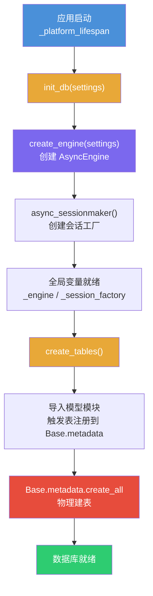
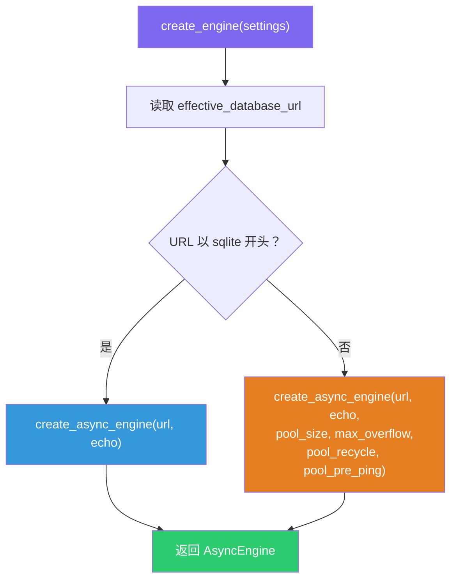
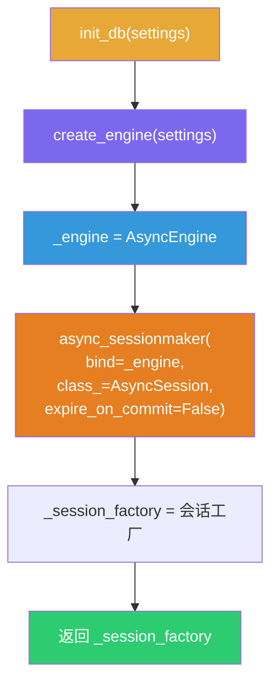
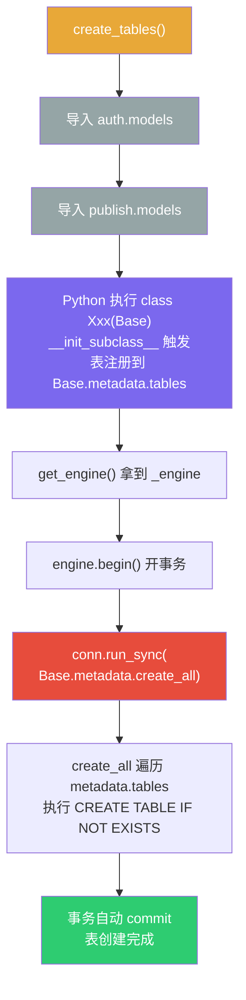
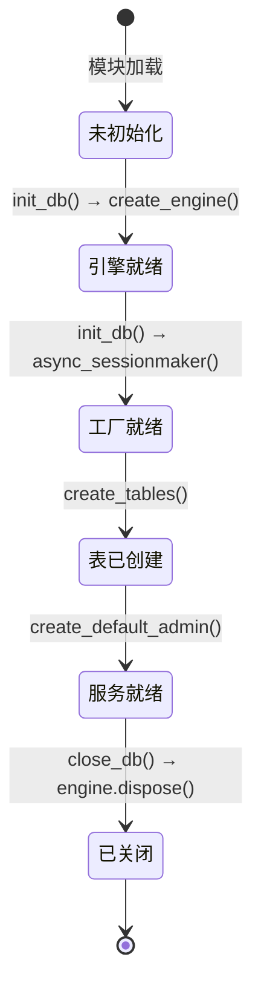

# 数据库初始化流程：从引擎到建表

> 应用启动时，`create_engine` → `init_db` → `create_tables` 三步完成
> 数据库连接建立、会话工厂创建、ORM 表注册与物理建表。

---

## 总览流程



---

## 调用链代码

入口在 `main.py` 的 lifespan：

```python
# main.py
@asynccontextmanager
async def _platform_lifespan(app):
    init_db(settings)          # 步骤 1+2：创建引擎 + 会话工厂
    await create_tables()      # 步骤 3：导入模型 + 物理建表
    session_factory = get_session_factory()
    async with session_factory() as db:
        await create_default_admin(db)  # 种子数据
    async with _agentscope_lifespan(app) as result:
        yield result
```

---

## 第一步：`create_engine` — 创建数据库引擎

```python
# database.py
def create_engine(settings: Settings) -> AsyncEngine:
    url = settings.effective_database_url

    # SQLite 不支持连接池参数
    if url.startswith("sqlite"):
        return create_async_engine(
            url,
            echo=settings.database_echo,
        )

    return create_async_engine(
        url,
        echo=settings.database_echo,
        pool_size=settings.database_pool_size,
        max_overflow=settings.database_max_overflow,
        pool_recycle=settings.database_pool_recycle,
        pool_pre_ping=True,
    )
```



| 参数 | SQLite | PostgreSQL | 作用 |
|------|:------:|:----------:|------|
| `url` | ✓ | ✓ | 数据库连接字符串 |
| `echo` | ✓ | ✓ | 打印 SQL 语句（调试用） |
| `pool_size` | ✗ | ✓ | 连接池空闲连接数 |
| `max_overflow` | ✗ | ✓ | 超出池大小后允许的额外连接数 |
| `pool_recycle` | ✗ | ✓ | 连接最大存活秒数，防止服务端超时断开 |
| `pool_pre_ping` | ✗ | ✓ | 取连接前探活（`SELECT 1`），丢弃死连接 |

SQLite 是文件级数据库，无需连接池；PostgreSQL 需要连接池管理高并发。

---

## 第二步：`init_db` — 初始化引擎 + 会话工厂

```python
# database.py
_engine: AsyncEngine | None = None
_session_factory: async_sessionmaker[AsyncSession] | None = None

def init_db(settings: Settings | None = None) -> async_sessionmaker[AsyncSession]:
    global _engine, _session_factory

    if settings is None:
        settings = get_settings()

    _engine = create_engine(settings)              # 调用第一步
    _session_factory = async_sessionmaker(
        bind=_engine,                               # 绑定引擎
        class_=AsyncSession,
        expire_on_commit=False,                     # commit 后仍可访问属性
    )
    return _session_factory
```



`init_db` 做了两件事：
1. **调用 `create_engine`** 创建引擎，存入全局变量 `_engine`
2. **创建会话工厂** `async_sessionmaker`，绑定引擎，存入全局变量 `_session_factory`

`expire_on_commit=False` 的含义：默认情况下 SQLAlchemy 在 `session.commit()` 后会"过期"所有已加载的对象，下次访问属性时重新查询数据库。设为 `False` 后 commit 后仍可直接访问属性，避免在异步上下文中触发意外的隐式查询。

---

## 第三步：`create_tables` — 导入模型 + 物理建表

```python
# database.py
async def create_tables() -> None:
    # 副作用导入：触发 class 定义，表注册到 Base.metadata
    from app.auth import models as _auth_models       # noqa: F401
    from app.publish import models as _publish_models  # noqa: F401

    async with get_engine().begin() as conn:
        await conn.run_sync(Base.metadata.create_all)
```



### 导入的真正目的

```python
from app.publish import models as _publish_models  # noqa: F401
```

不是为了用 `_publish_models` 这个变量，而是触发 `models.py` 里的类定义语句执行。当 Python 解释器遇到：

```python
class AgentPublication(Base):
    __tablename__ = "agent_publications"
    id: Mapped[str] = mapped_column(String(36), primary_key=True)
    ...
```

SQLAlchemy 的元类会自动把这张表注册到 `Base.metadata.tables["agent_publications"]`。

### `run_sync` 的作用

`Base.metadata.create_all` 是同步 API，不能直接 `await`。`run_sync` 把它放到引擎的线程池里执行：

```
主线程（事件循环）                    线程池
├─ await conn.run_sync(fn)          │
│   ├─ fn 丢进线程池  ──────────→   ├─ create_all(bind)
│   │                               ├─ CREATE TABLE IF NOT EXISTS ...
│   │                               ├─ CREATE TABLE IF NOT EXISTS ...
│   ←───────────────────────────────┤─ 返回
│   └─ 事务 commit
```

同步代码内部是阻塞执行的，不会让出控制权。`run_sync` 通过多线程让事件循环不被卡住。

---

## 全局变量状态变迁



| 阶段 | `_engine` | `_session_factory` | `metadata.tables` |
|------|-----------|-------------------|-------------------|
| 模块加载后 | `None` | `None` | 空 |
| `init_db()` 后 | `AsyncEngine` | `async_sessionmaker` | 空 |
| `create_tables()` 后 | `AsyncEngine` | `async_sessionmaker` | `agent_publications` 等已注册 |
| `close_db()` 后 | `None` | `None` | 不变（内存中仍存在） |

---

## 完整生命周期


