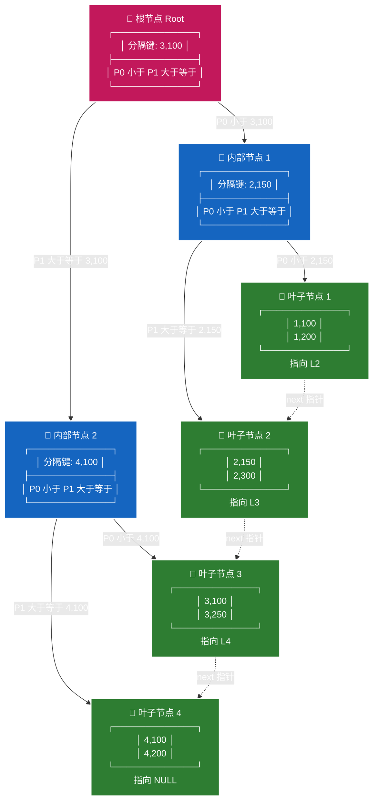

# 数据库索引原理

## 什么是索引

索引就像书的目录。

**没有索引**：查 `WHERE user_id = 'user123'`，数据库要从第一行扫到最后一行（全表扫描），逐行比对。

**有索引**：数据库维护一个排序好的"目录"，直接定位到 `user123` 在哪几行，跳过不相关的。

```
没有索引 — 全表扫描
┌────┬──────────┐
│ 1  │ user456  │  ← 检查
│ 2  │ user123  │  ← 命中
│ 3  │ user789  │  ← 检查
│ 4  │ user123  │  ← 命中
│... │ ...      │  ← 全部检查一遍
└────┴──────────┘

有索引 — 直接定位
索引（B+树，已排序）：
  user123 → 第2行、第4行
  user456 → 第1行
  user789 → 第3行

直接跳到第2、4行，不用扫全表
```

**代价**：写入时要同步更新索引，所以索引不是越多越好。只在经常用于 `WHERE`、`ORDER BY`、`JOIN` 的字段上建。

---

## B+ 树查找过程

索引是 **B+ 树**结构，查找方式是二分，不是逐条扫描。

假设表有 10 条记录，索引树高大约 2-3 层：

```
              [5]                    ← 根节点，先比较：比5大往右，比5小往左
            /     \
       [2,4]       [7,9]            ← 中间节点
      /  |  \     /  |  \
   [1][3] [6][8][10] [2] [3]...     ← 叶子节点（存实际行号）
```

查 `user_id = 8`：
- 第 1 次比较：8 > 5 → 走右边（排除掉一半）
- 第 2 次比较：8 > 7 → 走右边
- 第 3 次：找到 8 → 返回行号

**10 条记录只比较了 3 次**，不是 10 次。

10 条数据感觉不到差距，但如果表有 **100 万条记录**：
- 全表扫描：100 万次
- 索引查找：大约 **20 次**（log₂ 100万 ≈ 20）

这就是索引快的本质——不是减少存储，是减少查找次数。

---

## 索引类型对比

| 类型 | 查找行数 | 场景 |
|---|---|---|
| 无索引 | 全表（比如 10 万行） | 最慢 |
| 普通索引 | 几行到几百行（所有匹配的） | 字段值有重复 |
| 唯一索引 | **最多 1 行** | 字段值不重复，效率最高 |

索引字段的值越"分散"（高区分度），索引效率越高。最理想的就是唯一索引，查一行就是一行，不用再扫。

---

## 联合索引与最左前缀原则

联合索引 `(user_id, agent_id)` 是一个多列索引，遵循**最左前缀原则**：

```
联合索引 (user_id, agent_id) 排序方式：
  先按 user_id 排序，user_id 相同的再按 agent_id 排序

  (user1, agentA) → 第1行
  (user1, agentB) → 第3行
  (user2, agentA) → 第2行
  (user2, agentC) → 第4行
```

| 查询 | 能否使用联合索引 |
|---|---|
| `WHERE user_id = ?` | ✅ 最左前缀命中 |
| `WHERE user_id = ? AND agent_id = ?` | ✅ 完整命中 |
| `WHERE agent_id = ?` | ❌ 跳过了 user_id，无法使用 |

所以如果已有联合索引 `(user_id, agent_id)`，单独的 `user_id` 单列索引在大多数情况下是冗余的。

---

## 联合索引 B+ 树可视化

直观展示最左前缀匹配和排序规则，示例数据按 `(user_id, agent_id)` 进行字典序排序（先比较 `user_id`，再比较 `agent_id`）。



### 图例与关键点解读

**排序规则（字典序）**

- 索引先按 `user_id` 升序排列
- 当 `user_id` 相同时，再按 `agent_id` 升序排列
- 例如：`(1, 200) < (2, 150)`，因为 `1 < 2`；`(2, 150) < (2, 300)`，因为 `user_id` 相同但 `agent_id` 更小

**搜索路径（二分查找）**

- 查找 `(2, 300)`：根节点比较 `(2,300) < (3,100)` → 走 P0 到 IN1；IN1 比较 `(2,300) >= (2,150)` → 走 P1 到 L2；在 L2 中线性扫描找到 `(2,300)` 及其对应的主键/数据行
- 查找 `(3, 100)`：根节点比较 `(3,100) >= (3,100)` → 走 P1 到 IN2；IN2 比较 `(3,100) < (4,100)` → 走 P0 到 L3；命中

**叶子节点双向链表（范围查询）**

- 所有数据行只存储在叶子节点（绿色方块）中
- 叶子节点之间通过 next 指针（虚线箭头）串联，形成有序链表
- 范围查询场景（如 `WHERE user_id BETWEEN 2 AND 3`）：只需在 L2 找到起点，然后沿着虚线箭头向右遍历 L2 → L3，无需再回查根节点，极大提升范围扫描性能

**最左前缀原则体现**

- 该树结构以 `(user_id, agent_id)` 整体作为排序键
- 如果查询条件只带 `agent_id`（如 `WHERE agent_id = 100`），由于 `agent_id` 不是最左前缀，B+ 树无法利用此索引进行高效定位（只能全表扫描或走其他索引）
- 如果查询条件带 `user_id`（如 `WHERE user_id = 2`），则可以利用索引精准定位到 L2 节点，即使没有指定 `agent_id`，也能通过范围扫描获取所有 `user_id=2` 的数据

**内部节点（蓝色方块）的作用**

- 仅存储分隔键（子节点中最小的键值），用于路由搜索方向，不存储具体数据
- 指针 P0 指向"小于该键"的子节点，指针 P1 指向"大于等于该键"的子节点
