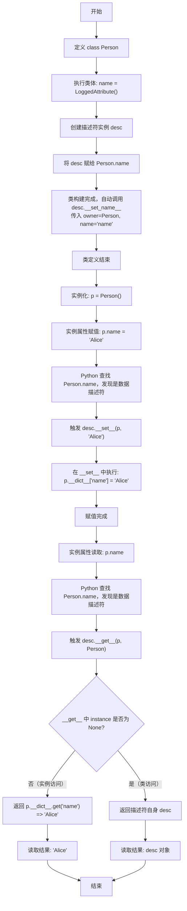

# Python 描述符机制：类属性与实例属性的分离

## 核心结论

- **`Person.name`（类属性）永远还是 `LoggedAttribute()` 对象，从未改变。**
- **`p.name`（实例读取结果）** 在赋值后，返回的是你赋给它的具体值（如字符串 `"Alice"`），不再是描述符对象。

---

## 代码验证

```python
class LoggedAttribute:
    def __set_name__(self, owner, name):
        self.name = name

    def __get__(self, instance, owner):
        if instance is None:
            return self  # 通过 Person.name 访问时返回描述符自身
        return instance.__dict__.get(self.name)

    def __set__(self, instance, value):
        print(f"拦截赋值，存入实例字典: {value}")
        instance.__dict__[self.name] = value

class Person:
    name = LoggedAttribute()  # 类属性指向描述符对象

p = Person()
p.name = "Alice"  # 触发 __set__，将 "Alice" 存入 p.__dict__

# 验证1：查看 Person 类本身
print(Person.name)
# 输出: <__main__.LoggedAttribute object at 0x...> （依然是 LoggedAttribute 对象）

# 验证2：查看实例 p 的内部字典
print(p.__dict__)
# 输出: {'name': 'Alice'} （实例字典存的是字符串）

# 验证3：查看 p.name 到底返回什么
print(p.name)
# 输出: Alice （触发 __get__，从 p.__dict__ 中取出字符串返回）
```

---

## 关键参数解释

### `owner` 参数

- `owner` 指的是**拥有该描述符的那个类对象**。
- 当 Python 执行到 `class Person:` 语句块**结束**时，会自动调用 `LoggedAttribute.__set_name__`，并将 `Person` 这个类对象作为实参传给 `owner` 形参。
- 示例：`LoggedAttribute.__set_name__(owner=Person, name='name')`

### `instance` 参数

- `instance` 指的是**当前操作的具体实例对象**（如 `p`）。
- 在类级别访问时（`Person.name`），`instance` 为 `None`。

---

## 完整执行流程



---

## 流程要点总结

| 操作 | 触发方法 | 关键动作 |
|---|---|---|
| 类定义（`class Person:`） | `__set_name__` | 描述符记住属性名 `'name'` 和宿主类 `Person` |
| 实例属性赋值（`p.name = ...`） | `__set__` | 将值存入 `instance.__dict__`，避免递归 |
| 实例属性读取（`p.name`） | `__get__` | 从 `instance.__dict__` 取出存储的值 |
| 类属性读取（`Person.name`） | `__get__` | `instance` 为 `None`，返回描述符自身 |

---

## 为什么不能直接用 `instance.name = value`？

在 `__set__` 中如果写 `instance.name = value`，会再次触发当前描述符的 `__set__`，造成**无限递归**。

因此必须使用 `instance.__dict__[self.name] = value` **直接操作底层字典**，绕过描述符协议。

---

## 适用场景

- **数据验证**（类型检查、范围限制）
- **ORM 框架**（将 Python 属性映射到数据库字段，赋值时标记脏对象）
- **只读/计算属性**
- **日志记录**（追踪属性访问）
