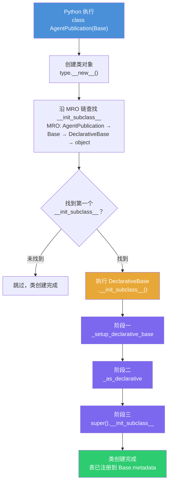
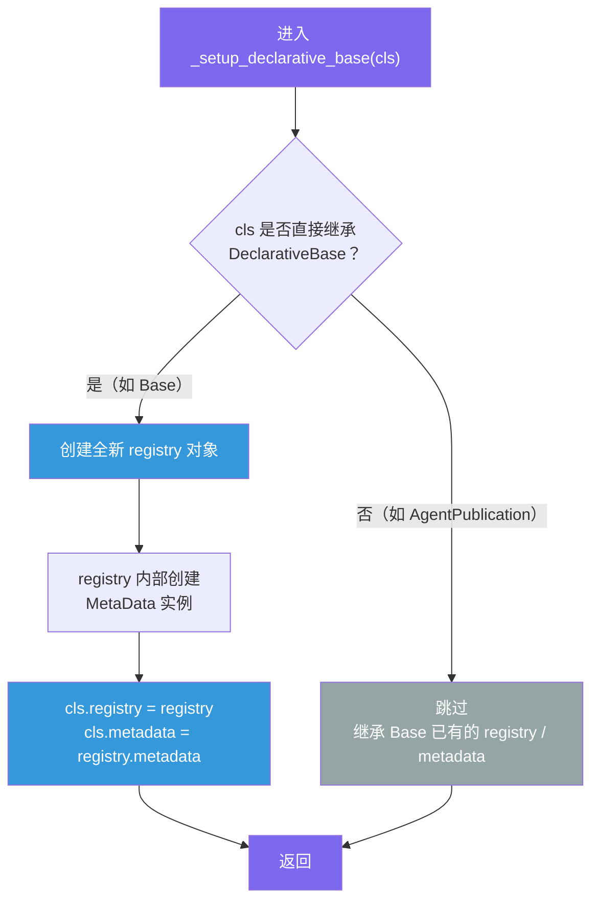
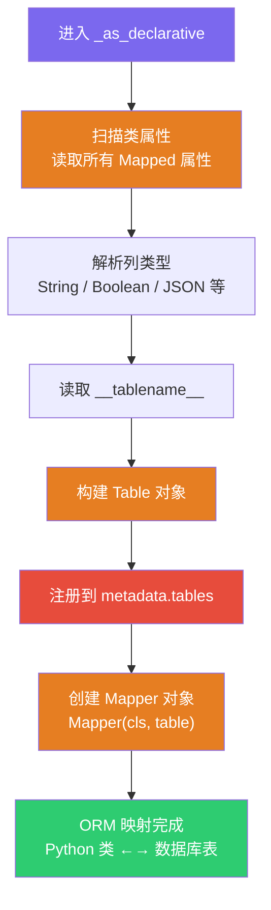
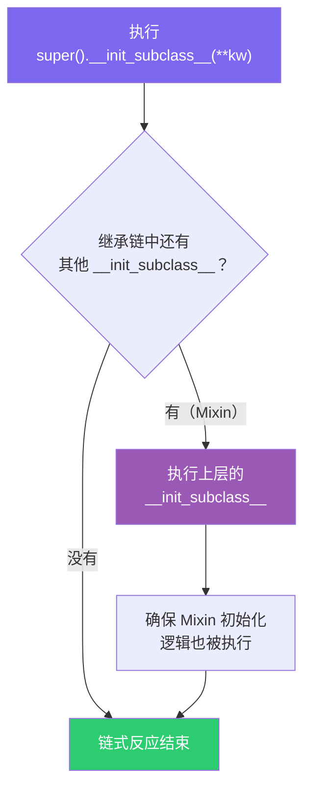

# SQLAlchemy 模型类定义到表注册 —— 完整流程图

> 以 `AgentPublication(Base)` 为例，从 Python 执行 `class` 语句开始，
> 沿 MRO 链扫描 `__init_subclass__`，到表对象注册进 `Base.metadata`。

---

## 总览流程



---

## 阶段一：`_setup_declarative_base` —— 建立"基地"



**核心要点**：

- `Base` 是"根"基类 → 为其创建独立的 `registry` + `metadata`
- `AgentPublication` 是子类 → 跳过，**共享** `Base` 的那套组件
- 这就是所有模型共享同一个 `metadata` 的根本原因

---

## 阶段二：`_ORMClassConfigurator._as_declarative` —— 执行"映射"



**核心要点**：

- `Mapped[str]` + `mapped_column(String(36))` → 被解析为列定义
- `__tablename__` 决定物理表名
- `Table` 对象被添加到 `metadata.tables` 字典 → 后续 `create_all` 靠这个字典知道要建哪些表
- `Mapper` 是 SQLAlchemy 内部的"映射登记簿"，连接 Python 类与 Table

---

## 阶段三：`super().__init_subclass__(**kw)` —— 保持"链式反应"



**核心要点**：

- 保证兼容性：如果使用了其他定义 `__init_subclass__` 的混入类（Mixin），它们的逻辑也会被执行
- Python 最佳实践：任何自定义 `__init_subclass__` 中都应调用 `super()`

---

## 完整调用链（代码级）

```
Python 解释器执行: class AgentPublication(Base):
    │
    ├─ 1. type.__new__(mcs, name, bases, namespace)
    │     创建类对象 AgentPublication
    │
    ├─ 2. 沿 MRO 查找 __init_subclass__
    │     MRO: AgentPublication → Base → DeclarativeBase → object
    │     发现 DeclarativeBase 定义了 __init_subclass__ ✓
    │
    └─ 3. DeclarativeBase.__init_subclass__(cls=AgentPublication, **kw)
          │
          ├─ _setup_declarative_base(cls)
          │   └─ cls 不是根基类 → 跳过，继承 Base 的 registry/metadata
          │
          ├─ _ORMClassConfigurator._as_declarative(cls, registry, metadata)
          │   ├─ 扫描 Mapped 属性 → 构建列
          │   ├─ 创建 Table("agent_publications", metadata, ...)
          │   ├─ metadata.tables["agent_publications"] = table  ← 注册！
          │   └─ Mapper(AgentPublication, table)                 ← 映射！
          │
          └─ super().__init_subclass__(**kw)
              └─ 链式传递，确保 Mixin 逻辑执行
```

---

## 从注册到建表：`create_tables()` 的角色


> `create_all` 只能**建表**，不能改表（`ALTER TABLE`）。
> 生产环境应使用 Alembic 迁移管理表结构变更。
