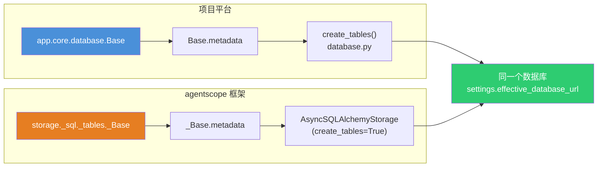
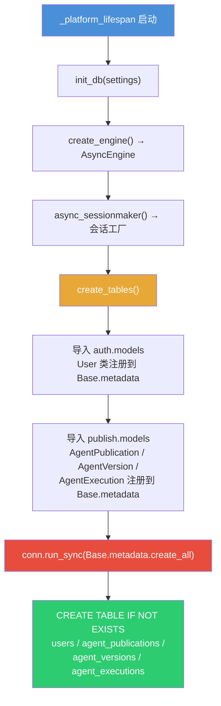
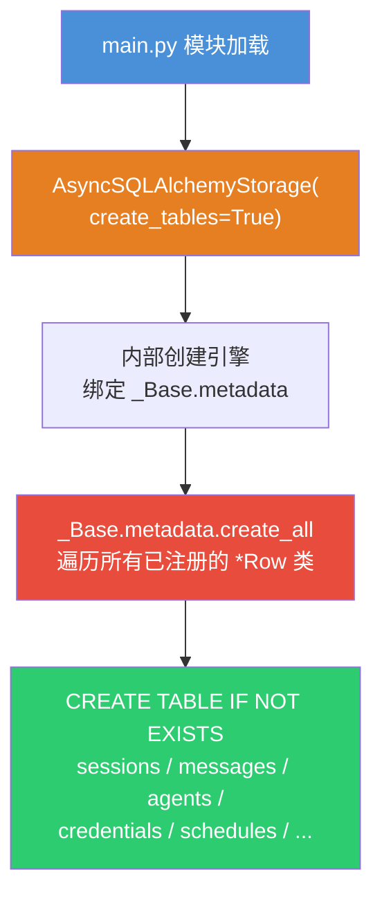
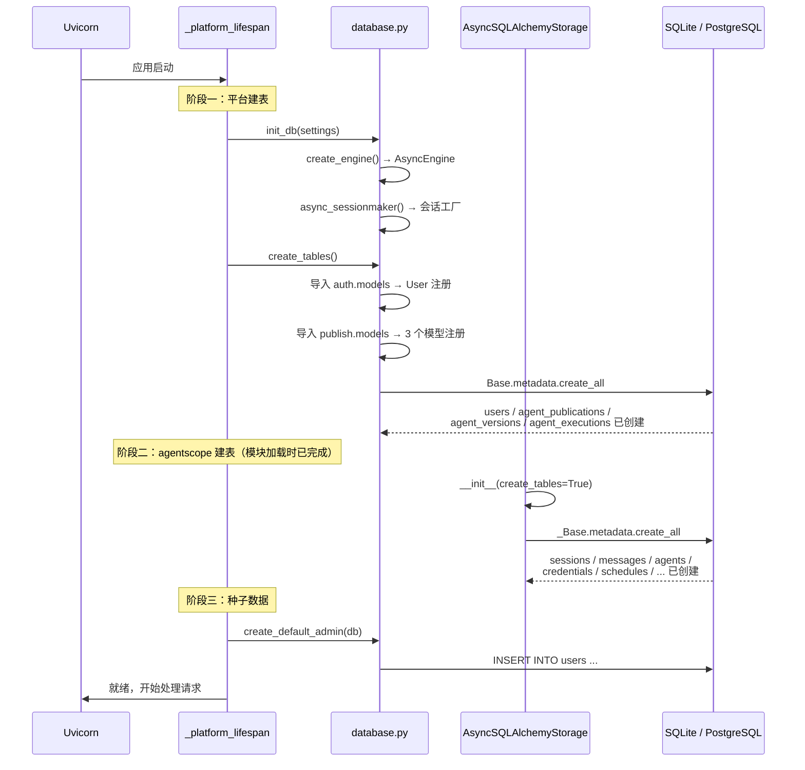

# 两套建表机制完整对比

> 项目存在两套独立的建表体系，共享同一个数据库，但各自拥有独立的
> `DeclarativeBase` 和 `metadata`。

---

## 总览



---

## 一、项目平台建表机制

### 触发函数

```python
# database.py
async def create_tables() -> None:
    from app.auth import models as _auth_models       # noqa: F401
    from app.publish import models as _publish_models  # noqa: F401

    async with get_engine().begin() as conn:
        await conn.run_sync(Base.metadata.create_all)
```

### 调用时机

```python
# main.py — 应用启动 lifespan
@asynccontextmanager
async def _platform_lifespan(app):
    init_db(settings)
    await create_tables()          # ← 这里触发
    ...
```

### 建表流程



### 创建的表

| 表名 | 模型类 | 定义位置 | 用途 |
|------|--------|----------|------|
| `users` | `User` | `auth/models.py` | 平台用户账号，支持本地密码和 OAuth2.0 登录 |
| `agent_publications` | `AgentPublication` | `publish/models.py` | 智能体发布记录，跟踪当前发布状态、版本号、执行模式 |
| `agent_versions` | `AgentVersion` | `publish/models.py` | 发布版本历史，存储每次发布的配置快照用于回滚 |
| `agent_executions` | `AgentExecution` | `publish/models.py` | 终端用户执行记录，用于审计和用量分析 |

### 表结构详情

#### `users`

```python
class User(Base):
    __tablename__ = "users"

    user_id:       Mapped[str]               # PK, UUID
    username:      Mapped[str]               # 唯一索引
    password_hash: Mapped[str]               # bcrypt 哈希
    role:          Mapped[str]               # "developer" | "end_user"
    auth_type:     Mapped[str]               # "password" | "oauth"
    oauth_user_id: Mapped[str | None]        # OAuth 用户 ID
    oauth_provider:Mapped[str | None]        # OAuth 提供商
    email:         Mapped[str | None]
    name:          Mapped[str | None]
    created_at:    Mapped[datetime]          # server_default=now()
```

#### `agent_publications`

```python
class AgentPublication(Base):
    __tablename__ = "agent_publications"

    id:                Mapped[str]             # PK, UUID
    agent_id:          Mapped[str]             # 唯一索引
    agent_name:        Mapped[str]
    agent_description: Mapped[str]
    published:         Mapped[bool]            # 是否已发布
    current_version:   Mapped[str]             # 当前版本号
    published_at:      Mapped[datetime | None]
    unpublished_at:    Mapped[datetime | None]
    published_by:      Mapped[str]             # 发布者 user_id
    execution_mode:    Mapped[str]             # "chat" | "task"
    input_schema:      Mapped[dict | None]     # JSON Schema (task 模式)
    created_at:        Mapped[datetime]
    updated_at:        Mapped[datetime]
```

#### `agent_versions`

```python
class AgentVersion(Base):
    __tablename__ = "agent_versions"

    id:              Mapped[str]               # PK, UUID
    publication_id:  Mapped[str]               # FK → agent_publications.id
    agent_id:        Mapped[str]               # 索引
    version:         Mapped[str]               # 短 SHA256 哈希
    release_notes:   Mapped[str]
    execution_mode:  Mapped[str]
    input_schema:    Mapped[dict | None]
    agent_snapshot:  Mapped[dict | None]        # 配置快照，用于回滚
    published_by:    Mapped[str]
    published_at:    Mapped[datetime]
    is_current:      Mapped[bool]
```

#### `agent_executions`

```python
class AgentExecution(Base):
    __tablename__ = "agent_executions"

    id:              Mapped[str]               # PK, UUID
    agent_id:        Mapped[str]               # 索引
    user_id:         Mapped[str]               # 索引，执行者
    session_id:      Mapped[str]               # 会话 ID
    execution_mode:  Mapped[str]               # "chat" | "task"
    input_params:    Mapped[dict | None]        # 表单参数 (task 模式)
    executed_at:     Mapped[datetime]
```

---

## 二、agentscope 框架建表机制

### 触发函数

```python
# main.py
storage = AsyncSQLAlchemyStorage(
    url=settings.effective_database_url,
    create_tables=True,          # ← 告诉 agentscope 自动建表
    auto_migrate=False,
)
```

`AsyncSQLAlchemyStorage` 内部在初始化时调用：

```python
# agentscope 内部
async with self._engine.begin() as conn:
    await conn.run_sync(_Base.metadata.create_all)
```

### 建表流程



### 创建的表

| 表名 | 模型类 | 用途 |
|------|--------|------|
| `sessions` | `SessionRow` | 会话记录，关联用户和智能体 |
| `messages` | `MessageRow` | 聊天消息，按会话存储 |
| `agents` | `AgentRow` | 智能体配置（agentscope 内部） |
| `credentials` | `CredentialRow` | 凭证存储 |
| `schedules` | `ScheduleRow` | 定时任务 |
| `teams` | `TeamRow` | 团队协作 |
| `knowledge_bases` | `KnowledgeBaseRow` | 知识库 |
| `knowledge_documents` | `KnowledgeDocumentRow` | 知识文档 |
| `mcps` | `MCPRow` | MCP 工具配置 |
| `skills` | `SkillRow` | 技能配置 |
| `channels` | `ChannelRow` | 渠道配置（项目 patch 注入） |

### 表结构详情

#### `sessions`

```python
class SessionRow(_JsonRecordMixin):
    __tablename__ = "sessions"

    id:                Mapped[str]         # PK
    created_at:        Mapped[datetime]
    updated_at:        Mapped[datetime]
    payload:           Mapped[dict]        # JSON，存剩余字段
    user_id:           Mapped[str]         # 索引
    agent_id:          Mapped[str]         # 索引
    source:            Mapped[str]         # 来源
    source_schedule_id:Mapped[str | None]  # 关联定时任务
    team_id:           Mapped[str | None]  # 关联团队
```

#### `messages`

```python
class MessageRow(_Base):
    __tablename__ = "messages"

    session_id:  Mapped[str]       # 复合 PK
    msg_id:      Mapped[str]       # 复合 PK
    created_at:  Mapped[datetime]
    payload:     Mapped[dict]      # JSON，消息内容
```

#### `agents`

```python
class AgentRow(_JsonRecordMixin):
    __tablename__ = "agents"

    id, created_at, updated_at, payload  # 继承自 _JsonRecordMixin
    user_id: Mapped[str]                 # 索引
    source:  Mapped[str]                 # 索引
```

#### 其余表（`credentials` / `schedules` / `teams` / `knowledge_bases` / `knowledge_documents` / `mcps` / `skills`）

均继承 `_JsonRecordMixin`，共享 `id + created_at + updated_at + payload` 信封结构，各自添加业务索引列。

#### `channels`（项目 patch 注入）

```python
# storage_channel.py — 项目扩展，注册到 agentscope 的 _Base
class ChannelRow(_Base):
    __tablename__ = "channels"

    id:              Mapped[str]
    created_at:      Mapped[datetime]
    updated_at:      Mapped[datetime]
    user_id:         Mapped[str]         # 索引
    channel_type:    Mapped[str]         # "discord" | "feishu" 等
    platform_bot_id: Mapped[str]         # 索引
    enabled:         Mapped[bool]
    payload:         Mapped[dict]        # JSON
```

---

## 三、核心差异对比

| 维度 | 项目平台 | agentscope 框架 |
|------|----------|-----------------|
| **DeclarativeBase** | `app.core.database.Base` | `storage._sql._tables._Base` |
| **metadata** | `Base.metadata` | `_Base.metadata` |
| **触发函数** | `create_tables()` (database.py) | `AsyncSQLAlchemyStorage(create_tables=True)` |
| **调用时机** | `_platform_lifespan` 启动时 | `main.py` 模块加载时（Storage 构造函数内部） |
| **DDL 执行** | `conn.run_sync(Base.metadata.create_all)` | 内部 `conn.run_sync(_Base.metadata.create_all)` |
| **表风格** | 每列显式定义，字段语义明确 | `_JsonRecordMixin` 信封模式：索引列 + `payload` JSON |
| **用途** | 平台业务（用户、发布、执行） | 框架运行时（会话、消息、智能体配置） |

---

## 四、完整建表时序



---

## 五、两套 metadata 的关系

```
项目 Base.metadata.tables          agentscope _Base.metadata.tables
├─ "users"                         ├─ "sessions"
├─ "agent_publications"            ├─ "messages"
├─ "agent_versions"                ├─ "agents"
├─ "agent_executions"              ├─ "credentials"
                                   ├─ "schedules"
                                   ├─ "teams"
                                   ├─ "knowledge_bases"
                                   ├─ "knowledge_documents"
                                   ├─ "mcps"
                                   ├─ "skills"
                                   └─ "channels"
         │                                    │
         └──────── 同一个数据库文件/实例 ────────┘
```

两套 `metadata` 互不感知，各自 `create_all` 时只建自己注册的表，不会互相干扰。`channels` 表比较特殊——它在项目的 `storage_channel.py` 中定义，但注册到了 agentscope 的 `_Base` 上，所以由 agentscope 侧的 `create_all` 负责建表。
