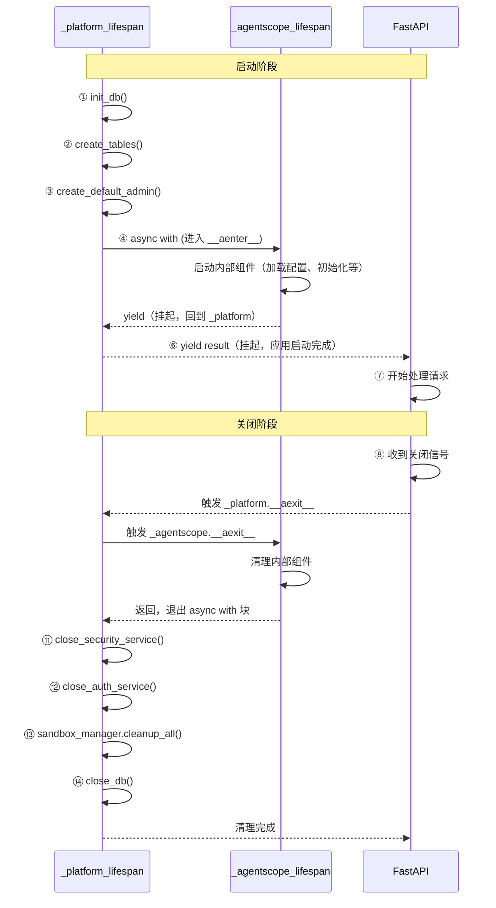

# Lifespan 机制：嵌套 yield 的执行流程

> `_platform_lifespan` 嵌套 `_agentscope_lifespan`，两层 yield 串联启动/关闭逻辑。

---

## 代码结构

```python
@asynccontextmanager
async def _platform_lifespan(app):
    # ① 项目启动
    init_db()
    await create_tables()

    # ② 进入 agentscope 的 lifespan（它内部也会 yield）
    async with _agentscope_lifespan(app) as result:
        # ④ agentscope 启动完成，回到这里
        yield result    # ⑤ 暂停 _platform_lifespan，把控制权交给 FastAPI

    # ⑦ FastAPI 关闭后，回到这里
    # ⑧ async with 块结束 → agentscope 自动清理
    # ⑨ 继续执行项目关闭代码
    await close_db()
```

---

## 三方执行时序



---

## 为什么要嵌套两层 yield

```
_platform_lifespan  yield  →  控制权交给 FastAPI
_agentscope_lifespan yield  →  控制权交给 _platform_lifespan
```

两层各自有自己的"启动/关闭"逻辑，`yield` 让它们按顺序串联起来：

1. ④ agentscope 启动完 → yield 给 `_platform_lifespan`（⑤）
2. ⑥ `_platform_lifespan` 启动完 → yield 给 FastAPI
3. ⑧ FastAPI 收到关闭信号 → 回到 `_platform_lifespan` 的 yield 下一行（⑨）
4. `async with` 块结束 → agentscope `__aexit__` 清理组件（⑩）
5. ⑪-⑭ `_platform_lifespan` 继续执行项目关闭代码

**反序退出**——先启动的后关闭，保证资源正确释放。

---

## yield 的本质

### 为什么需要 `@asynccontextmanager`

`async with` 要求右边的对象必须实现**异步上下文管理器协议**，即拥有 `__aenter__` 和 `__aexit__` 方法。

直接写 `async def my_func(): yield` 返回的是一个 `async_generator` 对象，它只有 `__anext__` 和 `__aiter__` 方法，没有那两个上下文管理方法。

`@asynccontextmanager` 装饰器把一个**异步生成器**包装成**异步上下文管理器**，从而让 `async with` 生效。

### yield 如何工作

`yield` 把当前函数**暂停**，把控制权交给**调用者**。

```python
@asynccontextmanager
async def my_func():
    print("启动")
    yield          # 暂停，控制权交给调用者
    print("关闭")

# 调用者这样用：
async with my_func():
    print("运行中")

# 输出顺序：
# 启动
# 运行中
# 关闭
```

执行流程：

```
my_func()          调用者
   │                 │
   ├─ print("启动")  │
   ├─ yield ────────→│  暂停 my_func，调用者拿到控制权
   │                 ├─ print("运行中")
   │                 ├─ 块结束，触发 __aexit__
   │←────────────────┘  回到 my_func yield 的下一行
   ├─ print("关闭")
   └─ 结束
```

---

## `@asynccontextmanager` 的协议

`@asynccontextmanager` 把函数变成异步上下文管理器：

- `yield` **之前**的代码 = `__aenter__`（启动阶段）
- `yield` **之后**的代码 = `__aexit__`（关闭阶段）
- 必须 yield 一次，否则不是合法的上下文管理器

```python
# ❌ 不 yield — 关闭代码永远不会执行
@asynccontextmanager
async def lifespan(app):
    init_db()
    # 没有 yield，函数直接结束

# ✅ 正确写法
@asynccontextmanager
async def lifespan(app):
    init_db()
    yield           # 标记分界点
    close_db()      # yield 之后 = 关闭阶段
```

---

## 实际代码（main.py）

```python
from contextlib import asynccontextmanager
from agentscope.app._lifespan import lifespan as _agentscope_lifespan

@asynccontextmanager
async def _platform_lifespan(app):
    """Platform lifespan that wraps agentscope's lifespan."""
    # Startup: initialize platform DB, create tables, seed default admin
    init_db(settings)
    await create_tables()
    session_factory = get_session_factory()
    async with session_factory() as db:
        await create_default_admin(db)
    # Enter agentscope's lifespan
    async with _agentscope_lifespan(app) as result:
        yield result
    # Shutdown: clean up platform resources (after agentscope cleanup)
    await close_security_service()
    await close_auth_service()
    if sandbox_manager:
        await sandbox_manager.cleanup_all()
    await close_db()

# 注册到 FastAPI
app.router.lifespan_context = _platform_lifespan
```

### agentscope 内部的 lifespan

```python
# agentscope/app/_lifespan.py
@asynccontextmanager
async def lifespan(app):
    storage = app.state.storage
    # ...
    async with AsyncExitStack() as stack:
        await stack.enter_async_context(storage)      # storage.__aenter__()
        await stack.enter_async_context(message_bus)   # message_bus.__aenter__()
        await stack.enter_async_context(workspace_manager)
        # ... 十几个组件 ...
        yield    # agentscope 启动完成，交给调用者
    # yield 之后：AsyncExitStack 反序调用每个组件的 __aexit__
```

`AsyncExitStack` 是 Python 标准库工具——往里面 `enter` 多个异步上下文管理器，关闭时**反序**自动调用 `__aexit__`。

---

## 完整启动/关闭顺序

### 启动（从上到下）

```
① init_db()                        ← 项目引擎
② create_tables()                  ← 项目表
③ create_default_admin()           ← 种子数据
④ agentscope lifespan 启动
   ├─ storage.__aenter__()         ← agentscope 引擎 + 建表
   ├─ message_bus.__aenter__()
   ├─ workspace_manager.__aenter__()
   └─ ... 十几个组件 ...
⑤ agentscope yield                 ← 交给 _platform_lifespan
⑥ _platform_lifespan yield         ← 交给 FastAPI，应用就绪
⑦ FastAPI 开始处理请求
```

### 关闭（反序退出）

```
⑧ FastAPI 收到关闭信号
⑨ 回到 _platform_lifespan yield 下一行
⑩ async with 块结束 → agentscope __aexit__
   ├─ ... 组件反序清理
   ├─ workspace_manager.__aexit__()
   ├─ message_bus.__aexit__()
   └─ storage.__aexit__()          ← agentscope 引擎关闭
⑪ close_security_service()
⑫ close_auth_service()
⑬ sandbox_manager.cleanup_all()
⑭ close_db()                       ← 项目引擎关闭
```
