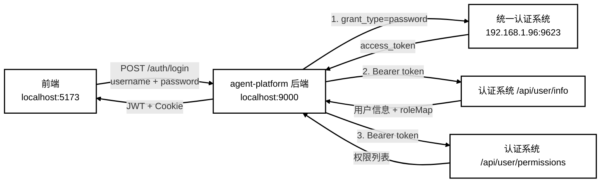
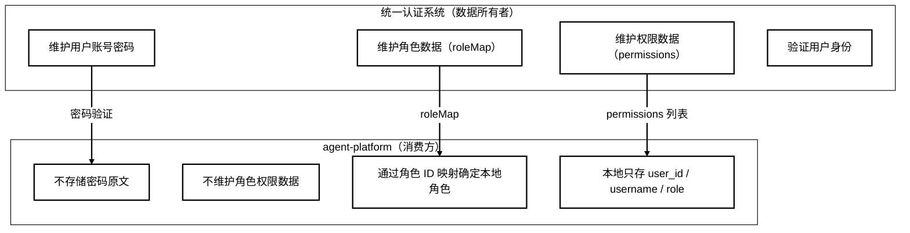
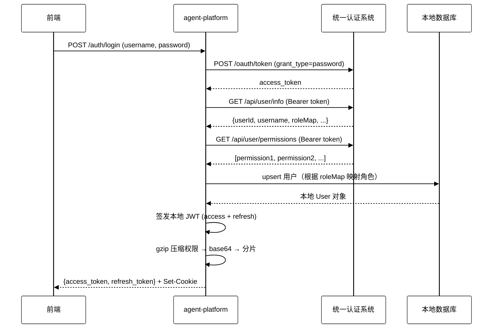
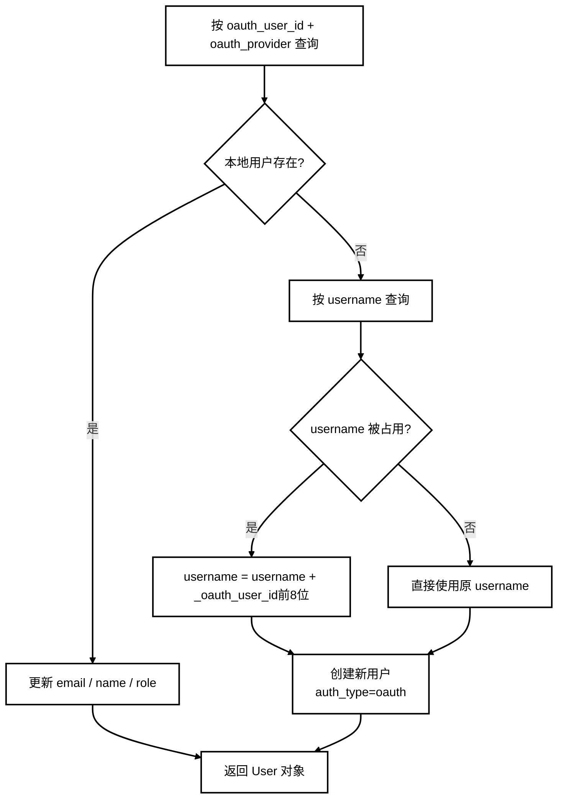
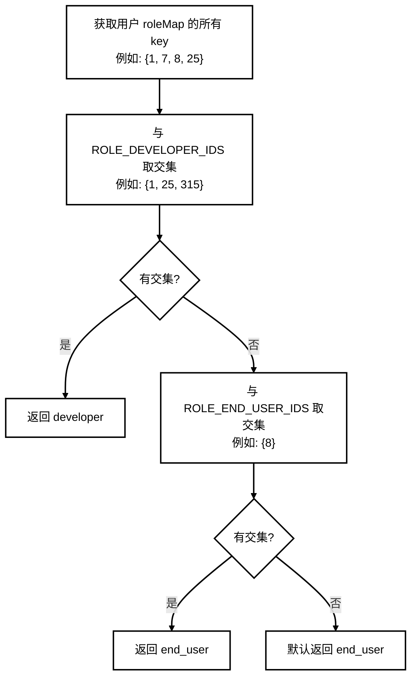
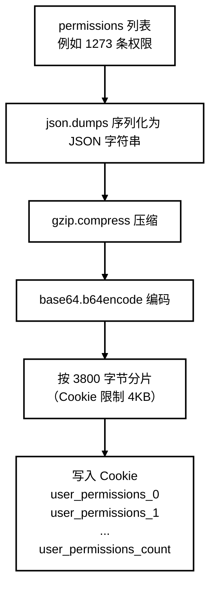
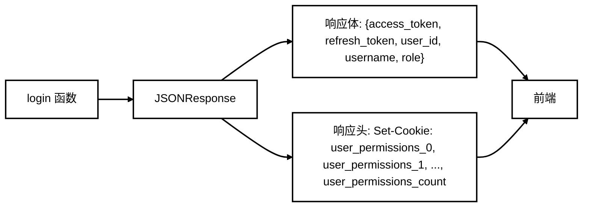

# OAuth2.0 登录认证与角色同步设计文档

## 设计目标

1. **统一认证**：接入公司统一认证系统（192.168.1.96:9623），实现 OAuth2.0 密码模式登录，本系统不独立维护用户账号和密码。
2. **角色同步**：通过认证系统返回的 roleMap 与本地角色 ID 匹配，自动确定用户在 agent-platform 中的角色身份。
3. **权限透传**：从认证系统获取用户权限列表，gzip 压缩 + base64 编码后分片写入 Cookie，前端可直接读取，无需重复请求。
4. **无状态鉴权**：后端签发 JWT（HttpOnly Cookie），前端请求自动携带，后端通过依赖注入完成身份校验和权限校验。
5. **前后端解耦**：前端（Vue3, localhost:5173）与后端（FastAPI, localhost:9000）通过 RESTful API + Cookie 交互，认证逻辑对前端透明。

## 开发环境

| 项目 | 说明 |
|------|------|
| 操作系统 | Windows 10 / Windows 11 |
| Python | 3.11.4 |
| 后端框架 | FastAPI + Uvicorn |
| 前端框架 | Vue 3 + Vite（localhost:5173） |
| 统一认证系统 | 192.168.1.96:9623（公司内网 OAuth2.0 服务） |
| 数据库 | SQLite / PostgreSQL（按项目实际配置） |
| 包管理 | uv / pip |
| 依赖注入 | FastAPI Depends |
| JWT 库 | python-jose / PyJWT |
| Cookie 编码 | gzip + base64（分片写入，单片 ≤ 3800 字节） |

---

> 本系统不维护权限数据，所有角色的权限数据均来自于统一认证系统，包括数据的维护。系统通过角色 ID 匹配的方式确定用户在系统中的角色身份。

---

## 二、总体结构设计

### 2.1 系统架构



### 2.2 核心职责划分



### 2.3 数据流总览



---

## 三、详细设计

### 3.1 接口列表

#### 3.1.1 agent-platform 登录接口

| 接口 | 方法 | 说明 |
|---|---|---|
| `/auth/login` | POST | 前端登录入口，接收 username + password |

请求体：

```json
{
  "username": "admin",
  "password": "***"
}
```

响应体：

```json
{
  "access_token": "***",
  "refresh_token": "***",
  "token_type": "bearer",
  "user_id": "xxx",
  "username": "admin",
  "role": "developer"
}
```

响应头（Cookie）：

```
Set-Cookie: user_permissions_0="H4sIA..."; HttpOnly; SameSite=strict
Set-Cookie: user_permissions_1="H4sIA..."; HttpOnly; SameSite=strict
Set-Cookie: user_permissions_count=2; HttpOnly; SameSite=strict
```

#### 3.1.2 统一认证系统接口

| 接口 | 方法 | 说明 |
|---|---|---|
| `/oauth/token` | POST | OAuth2.0 密码模式，换取 access_token |
| `/api/user/info` | GET | 获取用户信息（userId、roleMap 等） |
| `/api/user/permissions` | GET | 获取用户权限集合 |

---

### 3.2 环境配置（.env）

| 配置项 | 示例值 | 说明 |
|---|---|---|
| `OAUTH_AUTH_SERVER_URL` | `http://192.168.1.96:9623` | 认证系统基础地址 |
| `OAUTH_TOKEN_PATH` | `/oauth/token` | token 端点路径 |
| `OAUTH_CLIENT_ID` | `619aa32b-60b5-...` | OAuth 客户端 ID |
| `OAUTH_CLIENT_SECRET` | `ZSMwfsJRQ9WkEc...` | OAuth 客户端密钥 |
| `OAUTH_USERINFO_URL` | `http://192.168.1.96:9623/api/user/info` | 用户信息接口完整 URL |
| `OAUTH_PERMISSIONS_URL` | `http://192.168.1.96:9623/api/user/permissions` | 权限接口完整 URL |
| `ROLE_DEVELOPER_IDS` | `1,25,315` | 认证系统中开发者角色的 ID |
| `ROLE_END_USER_IDS` | `8, 314` | 认证系统中普通用户角色的 ID |

判断 OAuth 是否启用：当 `OAUTH_AUTH_SERVER_URL` 非空时启用。

---

### 3.3 登录流程详细设计

#### 3.3.1 判断是否启用 OAuth2.0

```python
settings = get_settings()
if settings.is_oauth_enabled:  # OAUTH_AUTH_SERVER_URL 非空
    # 走 OAuth2.0 密码模式
else:
    # 走本地密码验证
```

#### 3.3.2 OAuth2.0 密码模式获取 access_token

请求认证系统：

```
POST {OAUTH_AUTH_SERVER_URL}/oauth/token
Content-Type: application/x-www-form-urlencoded

grant_type=password
&username=admin
&password=***
&client_id={OAUTH_CLIENT_ID}
&client_secret={OAUTH_CLIENT_SECRET}
```

响应：

```json
{
  "access_token": "***",
  "token_type": "bearer",
  "refresh_token": "***",
  "expires_in": 3599,
  "scope": "all"
}
```

如果认证失败（401），返回 `用户名或密码错误`，不回退到本地验证。

#### 3.3.3 用认证系统的 access_token 获取用户信息

```
GET {OAUTH_USERINFO_URL}
Authorization: Bearer <认证系统的 access_token>
```

响应：

```json
{
  "status": 200,
  "data": {
    "userId": 1,
    "username": "admin",
    "userAlias": "admin",
    "email": null,
    "roleMap": {
      "1": "SuperRole",
      "7": "教师",
      "8": "学生",
      "25": "管理员"
    }
  }
}
```

#### 3.3.4 同步用户到本地数据库

从用户信息中提取字段：

| 认证系统字段 | 本地字段 | 处理逻辑 |
|---|---|---|
| `data.userId` → 转 str | `oauth_user_id` | 作为认证系统用户唯一标识 |
| `data.username` | `username` | 加 `_oauth` 后缀避免冲突（如被占用） |
| `data.email` | `email` | 直接存储 |
| `data.userAlias` 或 `data.username` | `name` | 显示名称 |
| `data.roleMap` | `role` | 通过角色映射确定（见 3.3.5） |

数据库查重逻辑：



#### 3.3.5 角色映射（核心逻辑）

本系统不维护角色数据，通过 `.env` 中配置的角色 ID 与认证系统返回的 `roleMap` 的 key 进行匹配：



代码实现：

```python
def _resolve_oauth_role(self, info: dict) -> str:
    role_map = info.get("roleMap", {})
    user_role_ids = set(role_map.keys())

    developer_ids = {s.strip() for s in settings.role_developer_ids.split(",") if s.strip()}
    end_user_ids = {s.strip() for s in settings.role_end_user_ids.split(",") if s.strip()}

    if developer_ids and user_role_ids & developer_ids:
        return Role.DEVELOPER
    if end_user_ids and user_role_ids & end_user_ids:
        return Role.END_USER
    return Role.END_USER  # 默认
```

优先级：developer > end_user > 默认 end_user。

#### 3.3.6 用认证系统的 access_token 获取权限集合

```
GET {OAUTH_PERMISSIONS_URL}
Authorization: Bearer <认证系统的 access_token>
```

响应：

```json
{
  "status": 200,
  "data": ["user:create", "role:update", "knowledge:save", ...]
}
```

#### 3.3.7 签发本地 JWT

使用本地用户的以下字段作为载荷：

| 字段 | 来源 | 说明 |
|---|---|---|
| `sub` | `user.user_id`（本地数据库） | 用户唯一标识 |
| `username` | `user.username` | 本地用户名 |
| `role` | `user.role`（角色映射结果） | developer / end_user |
| `roles` | `[user.role]` | 角色列表 |
| `permissions` | `[]`（预留） | 权限列表（实际从 Cookie 获取） |
| `exp` | 当前时间 + 30分钟（access）/ 7天（refresh） | 过期时间 |
| `iat` | 当前时间 | 签发时间 |
| `iss` | `agent-platform` | 签发者 |
| `type` | `access` / `refresh` | token 类型 |

签发两个 token：

```python
access_token = jwt.encode(access_payload, secret_key, algorithm="HS256")
refresh_token = jwt.encode(refresh_payload, secret_key, algorithm="HS256")
```

返回字典：

```python
{
    "access_token": "***",
    "refresh_token": "***",
    "token_type": "bearer",
    "user_id": "xxx",
    "username": "admin",
    "role": "developer",
    "permissions": ["user:create", ...]  # 从认证系统获取的权限列表
}
```

#### 3.3.8 权限数据处理并写入 Cookie

login 接口函数从返回结果中取出 permissions，进行压缩处理：



Cookie 安全属性：

| 属性 | 值 | 说明 |
|---|---|---|
| `HttpOnly` | `true` | JavaScript 无法读取，防 XSS |
| `SameSite` | `strict` | 跨站请求不携带，防 CSRF |
| `Secure` | 生产环境 `true` | 仅 HTTPS 传输 |
| `Max-Age` | 1800（30分钟） | 与 access_token 过期时间一致 |

#### 3.3.9 响应回前端

login 接口函数将 JWT token（响应体）和权限 Cookie 一并返回：



前端处理：
1. 从响应体取出 `access_token` 和 `refresh_token`，存入 `localStorage`
2. 浏览器自动存储响应头中的 Cookie
3. 之后每次请求：`Authorization: Bearer <access_token>`
4. 后端从 Cookie 读取权限数据用于接口鉴权

---

## 四、关键设计决策

### 4.1 为什么权限数据用 Cookie 而不是响应体

| 方案 | 优点 | 缺点 |
|---|---|---|
| Cookie（当前方案） | 后端可直接读取，HttpOnly 防 XSS | 有大小限制，需要压缩分片 |
| 响应体 + localStorage | 无大小限制 | JavaScript 可读取，存在 XSS 风险 |

当前方案：响应体返回 JWT token（前端存 localStorage），Cookie 存权限数据（后端可读取，前端不可读取）。

### 4.2 为什么不把权限放入 JWT

JWT 载荷会 base64 编码后传输，但**不加密**，任何人拿到 JWT 都能看到内容。权限数据量大（1000+ 条），放入 JWT 会显著增大 token 体积，增加每次请求的传输开销。Cookie 分片 + 压缩是更优方案。

### 4.3 角色映射的优先级

developer 优先于 end_user，因为：
- developer 能做 end_user 能做的所有事
- 如果一个人同时拥有开发者和普通用户角色，应该分配更高权限
- 未命中任何映射时默认 end_user（最小权限原则）
